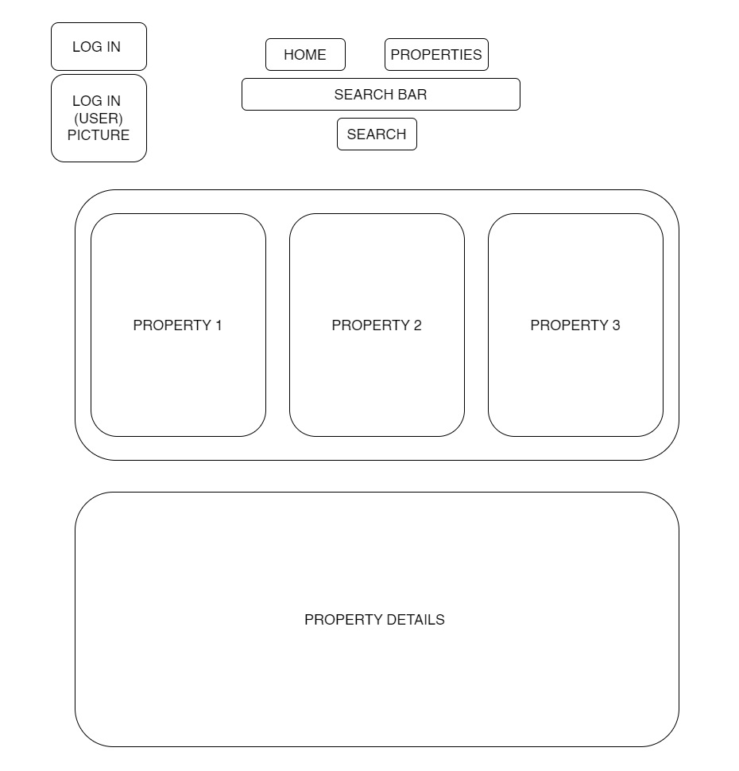

# Real_Estate_Platform

This web application is designed to manage real estate properties, users, and bookings. It is built using Django, PostgreSQL for the backend,React and Vite for the frontend. The application supports full CRUD operations and includes search functionality.

## Table of Contents
- [Installation](#instalation)
- [Backend Structure](#backend-structure)
- [Diagrams](#diagrams)
  - [ERD](#erd)
  - [Hierarchy Diagram](#hierarchy-diagram)
  - [Wireframe](#wireframe)
- [Frontend Structure](#frontend-structure)
  - [Features](#features)
- [API Endpoints](#api-endpoints)
- [Search Functionality](#search-functionality)
- [Credits](#credits)
- [Links to my Socials](#links-to-my-socials)


## Instalation

1. Make directory:
    ```sh
    mkdir Real_Estate_Platform
    cd Real_Estate_Platform_Project
    ```
2. Set up a virtual environment:
    ```sh
    sudo apt install pipenv
    pipenv shell
    ```
3. Install backend dependencies:
    ```sh
    pipenv install django
    pipenv install psycopg2-binary
    pipenv install djangorestframework
    pip install django-cors-headers
    ```
4. Create App:
    ```sh
    pipenv run django-admin startproject projectName_django .
    django-admin startapp Real_Estate
    ```
5. Set up PostgreSQL and configure your `DATABASES` setting in `settings.py`:
    ```sh
    touch settings.sql
    psql -f settings.sql 
    ```
6. Apply database migrations:
    ```sh
    python3 manage.py makemigrations
    python3 manage.py migrate
    ```

7. Create a superuser:
    ```sh
    python3 manage.py createsuperuser
    ```
8.  Install frontend dependencies:
    ```sh
    cd fron-tend
    npm create vite@latest
    npm run dev 
    npm install react-router-dom
    npm install @react-google-maps/api
    ```
9. Run the development servers:
    ```sh
    # In one terminal window, run the Django server
    python3 manage.py runserver

    # In another terminal window, run the React development server
    npm run dev
    ```

## Backend Structure 

* Models: User, Property, Booking
* Serializers
* Views

## ERD


## Component Hierarchy Diagram


## Wireframe



## Frontend Structure

### Features

* Full CRUD functionality for properties.
* User login.
* Property search by price range, city, and address.
* Google Maps integration for property locations.
* Booking management for users.

## API Endpoints

* GET /api/properties/ - List all properties
* POST /api/properties/ - Create a new property
* GET /api/properties/:id/ - Retrieve a property
* PUT /api/properties/:id/ - Update a property
* DELETE /api/properties/:id/ - Delete a property

## Search Functionality

* GET /api/properties/search/?price_min=&price_max=&city=&address=/ - Search propertiesby criteria

## Credits

* Environment Variables
  - [React](https://www.dhiwise.com/post/react-environment-variables-your-guide-to-secure-react-apps)
  - [Vite](https://vitejs.dev/guide/env-and-mode)
* Googel Maps
  - [Google Maps Platform](https://developers.google.com/maps/get-started)
* Enumerated Data Types
  - [Python Docs](https://docs.python.org/3/library/enum.html)
  - [HackSoft](https://www.hacksoft.io/blog/introducing-django-enum-choices-2)
  - [ChatGPT](https://chatgpt.com/)

## Links to my Socials

 * [GitHub](https://github.com/Vladimir1000)
